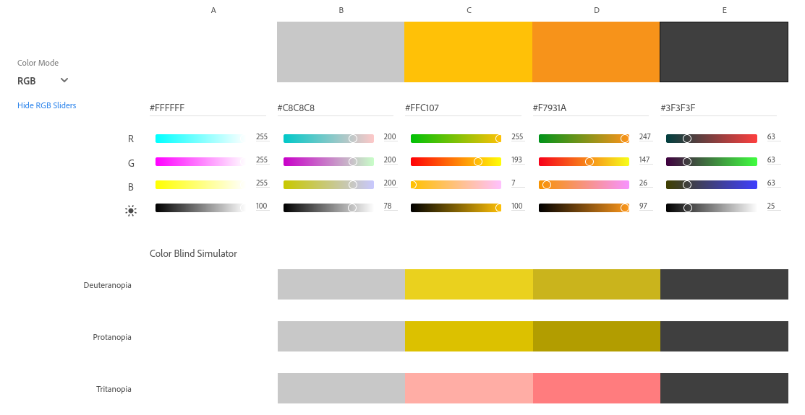
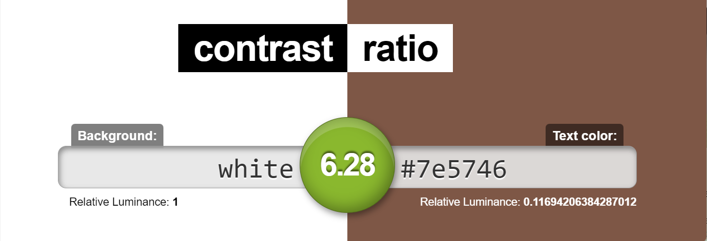
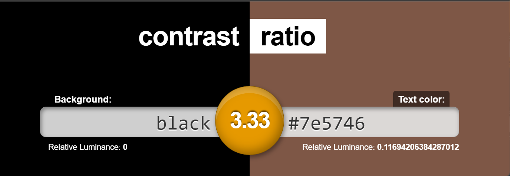
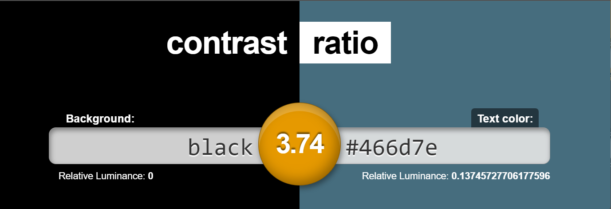
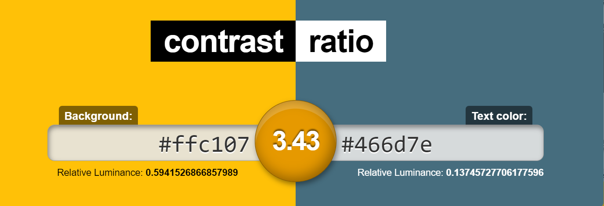
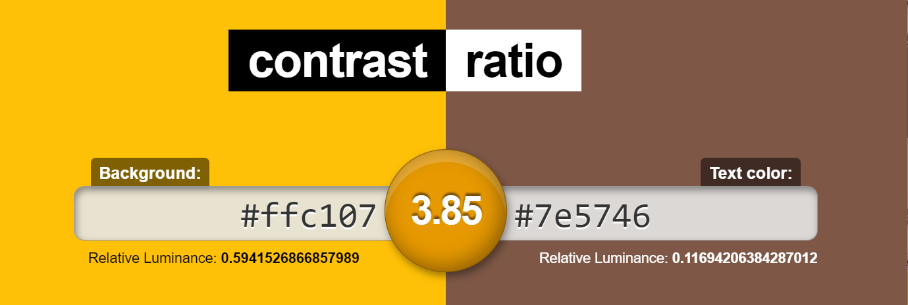
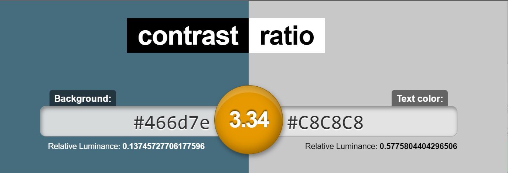
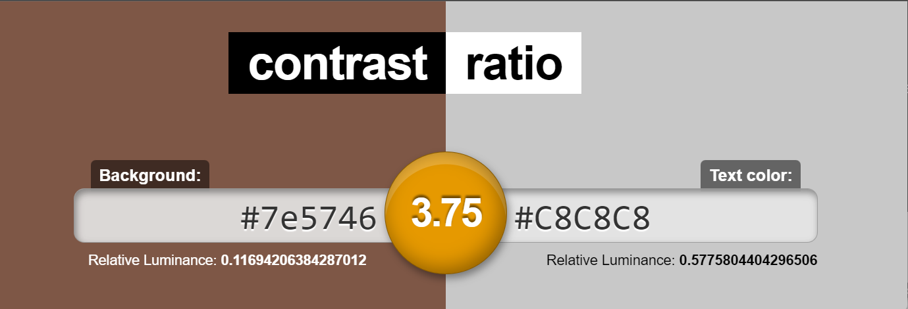
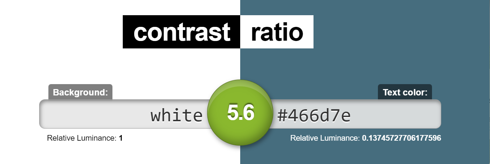

# Guia de Estilo e Identidade Visual

| Data | Versão | Descrição | Autor |
| :-: | :-: | :-: | :-: |
| 16/07/2022 | 0.1 | Criação do documento de Identidade Visual | Renato Gabriel |
| 02/08/2022 | 0.2 | Adiciona logo, atualiza fontes e paleta cores e seus contrastes. | Pablo S. Costa |

# 1. Introdução

# 2. Apresentação da Identidade Visual

<iframe src="https://docs.google.com/presentation/d/e/2PACX-1vSvMFDcCdfWP0mqZpcuShpTH0Je8aQZvF3ZeLZfLLYKyDNINb5WfyVPU8P64sG94PylgKg1VKqEI3cz/embed?start=false&loop=true&delayms=5000" frameborder="0" width="960" height="540" allowfullscreen="true" mozallowfullscreen="true" webkitallowfullscreen="true"></iframe>

# 3. Detalhamento e Justificativas

## 3.1. Nome da aplicação

## 3.2. Fontes

As fontes utilizadas na página serão:

 - **Courier New** (MIT License), para títulos e elementros gráficos.
 - **OpenSans** (Apache License, Version 2.0), para textos em geral.

Esta familia de fontes segue o padrão sans-serif, facilitando a leitura para pessoas com dislexia, já que não possui traços e hastes rebuscadas.

Além disso, estas fontes permitem uma boa vizualização tanto em dispositivos mobile quanto web e suas licenças permitem uso gratuito.

### Uso das fontes

#### Incluindo no HTML

Coloca-se no <head> o seguinte trecho de código:

	<link href="https://fonts.googleapis.com/css2?family=Open+Sans:ital,wght@0,300;0,400;0,500;0,600;0,700;1,300;1,400;1,500;1,600;1,800&display=swap" rel="stylesheet"> 

#### Incluindo no CSS

Coloca-se no css, para a utilização das fontes:

	font-family: 'Open Sans', sans-serif;
	font-family: 'Courier New';

# 3.2.Paleta de cores

As cores foram escolhidas de forma a complementar o logo da página foi levado em conta também a acessibilidade no processo de definição da palleta. A paleta tem como cor primária #466D7E e #FFC107, e #7E5746 como cor secundária e 
As ferramentas utilizadas para construi-la foram:

- [**Coolors**](https://coolors.co/3f3f3f-c8c8c8-466d7e-ffc107-7e5746)
- [**Corhexa**](https://corhexa.com/ffc107)

É importante a combinação correta das cores da paleta, maximizando o contraste sempre que possível, com o objetivo de garantir uma boa legibilidade dos conteúdos da aplicação.

### Use combinações como essas

 
 
 
 
 
 
 
 

### Evite essas usar essas

 
 
 

# 4. Componentes

## 4.1. Botões

Á definir

## 4.2. Campos de formulários

Á definir