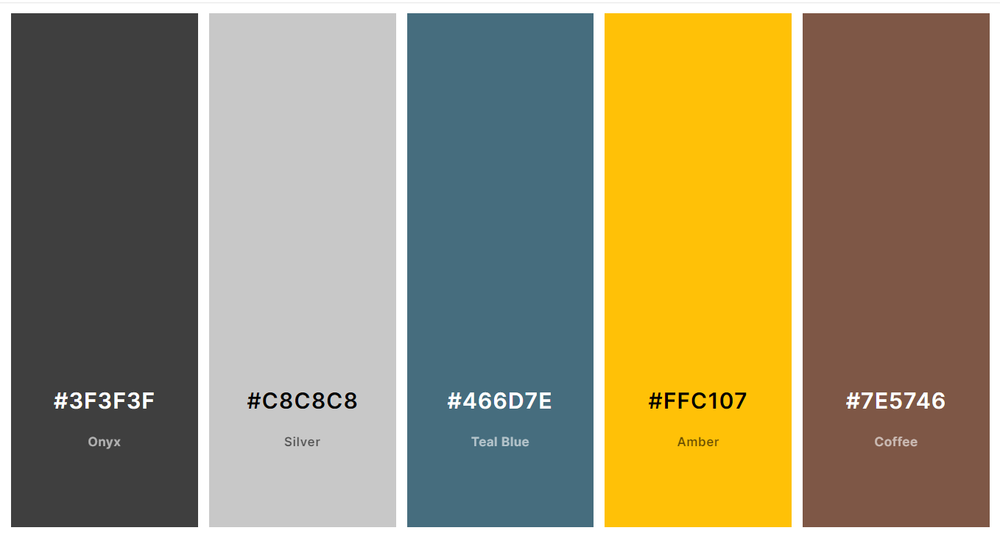
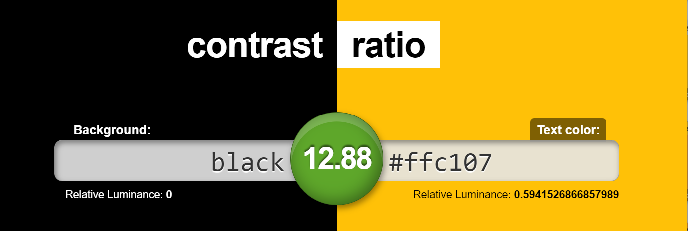

# Guia de Estilo e Identidade Visual

| Data | Versão | Descrição | Autor |
| :-: | :-: | :-: | :-: |
| 16/07/2022 | 0.1 | Criação do documento de Identidade Visual | Renato Gabriel |

# 1. Introdução

# 2. Apresentação da Identidade Visual

Á definir

# 3. Detalhamento e Justificativas

## 3.1. Nome da aplicação

## 3.2. Fontes

As fontes utilizadas na página serão:

 - **OpenSans** (Apache License, Version 2.0), para títulos e textos.

Esta familia de fontes segue o padrão sans-serif, facilitando a leitura para pessoas com dislexia, já que não possui traços e hastes rebuscadas.

Além disso, estas fontes permitem uma boa vizualização tanto em dispositivos mobile quanto web e suas licenças permitem uso gratuito.

### Uso das fontes

#### Incluindo no HTML

Coloca-se no <head> o seguinte trecho de código:

	<link href="https://fonts.googleapis.com/css2?family=Open+Sans:ital,wght@0,300;0,400;0,500;0,600;0,700;1,300;1,400;1,500;1,600;1,800&display=swap" rel="stylesheet"> 

#### Incluindo no CSS

Coloca-se no css, para a utilização das fontes:

	font-family: 'Open Sans', sans-serif;

# 3.2.Paleta de cores

As cores foram escolhidas de forma a complementar o logo da página foi levado em conta também a acessibilidade no processo de definição da palleta. A paleta tem como cor primária #FFC107, e #F7931A como cor secundária e 
As ferramentas utilizadas para construi-la foram:

- [**Colormind**](http://colormind.io/)
- [**Adobe** **Color**](https://color.adobe.com/create/color-accessibility)

É importante a combinação correta das cores da paleta, maximizando o contraste sempre que possível, com o objetivo de garantir uma boa legibilidade dos conteúdos da aplicação.

### Use combinações como essas

### Evite essas usar essas

 

# 4. Componentes

## 4.1. Botões

Á definir

## 4.2. Campos de formulários

Á definir