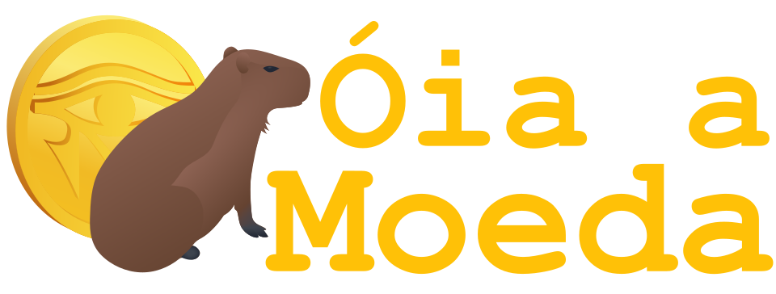

<p align="center">  </p>

[](https://bettercodehub.com/)

## 📝Sobre
Este projeto tem como objetivo criar um site para uma melhor visualização de informações referentes ás cripto moedas presentes no mercado atualmente, em conjunto com noticias sobre as mesmas, com o objetivo de reduzir o tempo gasto por investidores e empresas ao realizar uma analise mais aprofundada, ou mais rasa, sobre a moeda desejada

## 💻Tecnologias Utilizadas
Cada Tag pode ser clicada e levará para o link de download da tecnologia ou de como utiliza-la em outra plataforma(como o VScode), para ser mais pratico de se contribuir  😊

### 👨‍💻Desenvolvimento
[](https://code.visualstudio.com/download)
[](https://developer.mozilla.org/pt-BR/docs/Web/JavaScript)
[](https://code.visualstudio.com/docs/languages/html)
[](https://code.visualstudio.com/docs/languages/css)
[](https://getbootstrap.com/docs/5.2/getting-started/introduction/)
[](https://desktop.github.com/)
  
 

### 🗣️Comunicação
[](https://discord.com/download)
[](https://web.whatsapp.com/)
[](https://web.telegram.org/)

## 📜Como Contribuir
Para contribuir com o projeto, é extremamente importante e recomendado que siga o [Guia de como contribuir com o projeto](https://github.com/fga-eps-mds/2022-1-OiaAMoeda/blob/main/Docs/Como_Contribuir.md) onde será encontrado tudo que vai ser necessário para se contribuir com o projeto. Como por exemplo templates, política de branches, política de commits e tutoriais de como criar uma issue e/ou um pull request.              
O usuário que estiver disposto a contribuir com o projeto deverá deverá estar atento ao [Codigo de Conduta]( https://github.com/fga-eps-mds/2022-1-OiaAMoeda/blob/main/Docs/Codigo_de_conduta.md).


## 👨‍💻💪Instalação e execução do projeto

### 👨‍💻Requisitos

#### Git
https://git-scm.com/downloads

#### Node
É necessário ter instalado e configurado o node ^16.17.0.
Download: https://nodejs.org/en/download/

#### Apache2
https://www.digitalocean.com/community/tutorials/how-to-install-the-apache-web-server-on-ubuntu-22-04

### 💪Execução
Execução no Ubuntu 22.04.1 LTS

1. Entre na pasta.
```sh
cd $HOME
```

2. Clone o repositório do projeto:
```sh
git clone https://github.com/fga-eps-mds/2022-1-OiaAMoeda.git
```

3. Remova versão antigas e copie o frontend para o servidor apache
```sh
sudo rm -r /var/www/html/UI | sudo cp -r $HOME/2022-1-OiaAMoeda/OiaMoeda/UI/ /var/www/html/
```
> Este comando deve ser executado á cada nova versão/alteração para que possam ser aplicadas. Apos as modificações forçar atualizacão sem cache com o comando Ctrl + Shift + R.

4. Entre na pasta do backend:
```sh
cd $HOME/2022-1-OiaAMoeda/OiaMoeda/server/
```

5. Instale as dependências:
```sh
npm i
```

6. Execute o server
```sh
 node server.js
```

link do video da release 2: https://drive.google.com/drive/folders/1UAXGwSgYdNfpRLNlubQ8GyU2GEbKM8s9?usp=sharing

> :warning: O frontend por padrão fica no localhost:80/UI e o backend está em localhost:3003
